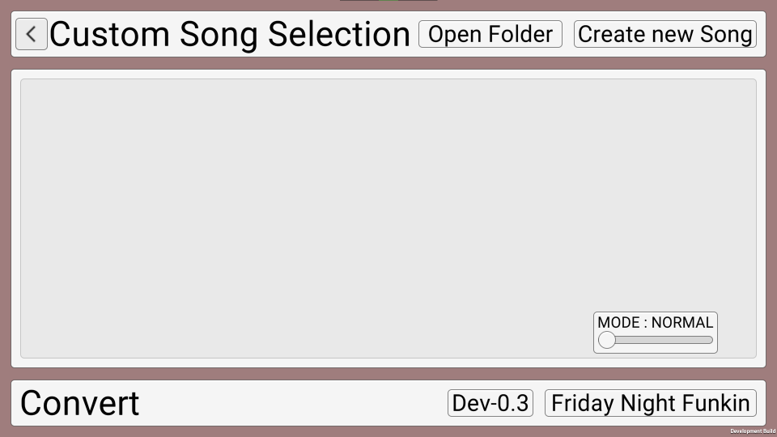

# DDRG DOCUMENTATION AND HELP

Here's the more or less complete documentation for the "Devilish Deviants Rhythem Game"

## Skip
- [GET STARTED](#Get%20Started)
- [INSTALLATION](#Installation)
- [CUSTOM SONG SCREEN](#Custom%20Song%20Screen)
- - [CREATING A NEW SONG](#Creating%20a%20new%20Song)
- - [PLAYING A SONG](#Playing%20a%20song)
- - [CONVERTING SONGS](#Converting%20from%20Dev-0.3%20or%20FNF)
- - - [FROM DEV-0.3](#Converting%20from%20Dev-0.3)
- - - [FROM FNF](#Converting%20from%20FNF)
- [EDITOR](#Editor)

## Get Started

Start by downloading DDRG

- [Latest](https://github.com/Andreas010/DDRG/releases/latest)
- [All Releases](https://github.com/Andreas010/DDRG/releases)

Make sure to download the right version (x86_64 or x64)
All the downloads are currently Windows only, but maybe in the future more OS builds will exist

## Installation

After downloading the version of DDRG, you can simply extract it to any directory
Run "Rhythm Game.exe" and you should see your game starting

## Custom Song Screen

This is the song, where you can play, edit and delete custom songs made for DDRG

### Creating a new Song

### Playing a song

### Converting from Dev-0.3 or FNF

#### Converting from Dev-0.3

#### Converting from FNF

## Editor