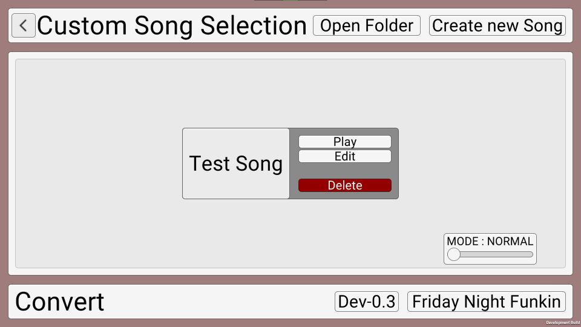
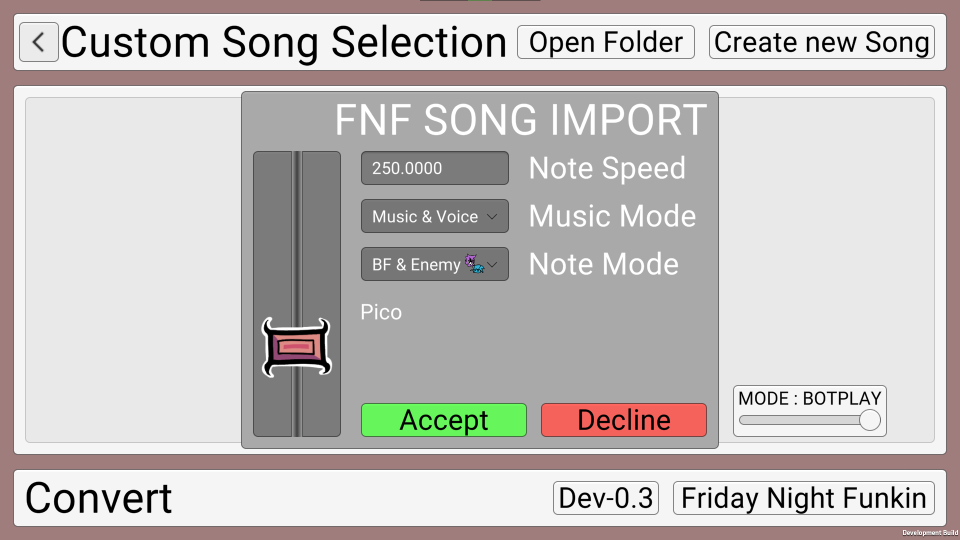
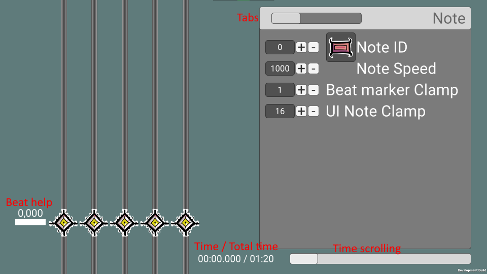

# DDRG DOCUMENTATION AND HELP

Here's the more or less complete documentation for the "Devilish Deviants Rhythem Game"

If you are having an issue or want to propose an idea for a feature, goto "https://github.com/Andreas010/DDRG/issues" and create an issue, if it doesn't exist yet

* * *

## Skip
- [GET STARTED](#get-started)
- [INSTALLATION](#installation)
- [CUSTOM SONG SCREEN](#custom-song-screen)
- - [CREATING A NEW SONG](#creating-a-new-song)
- - [PLAYING A SONG](#playing-a-song)
- - - [CHANGING THE SONG MODE](#changing-the-song-mode)
- - [CONVERTING SONGS](#converting-from-dev-03-or-fnf)
- - - [FROM DEV-0.3](#converting-from-dev-03)
- - - [FROM FNF](#converting-from-fnf)
- [EDITOR](#editor)

## Get Started

Start by downloading DDRG

- [Latest](https://github.com/Andreas010/DDRG/releases/latest)
- [All Releases](https://github.com/Andreas010/DDRG/releases)
- [Changelog](./changelog)

Make sure to download the right version (x86_64 or x64)

All the downloads are currently Windows only, but maybe in the future more OS builds will exist

## Installation

After downloading the version of DDRG, you can simply extract it to any directory
Run "Rhythm Game.exe" and you should see your game starting

## Custom Song Screen

This is the song, where you can play, edit and delete custom songs made for DDRG


### Creating a new Song

To create your own custom song, click the button in the top right corner saying "Create new Song".
When clicked a little window should pop up, asking you to give your song a name.
> Make sure, that the song name doesn't interfere with Windows' Path and File naming rules.

After clicking the button to create a new song, an explorer window should pop up.

Put your "song.wav" file in that opened folder. "song.wav" is the audio file played, when playing your level.
> If you don't put a "song.wav" file into the folder and either edit or play, you will experience issues.

From there you can edit your song!
[Editing your song](#Editor)

### Playing a song

Click on the white box, containing the song name, you want to play. It should move to the center of the screen. While moving it will open it's "interface"
> To open any other song's interface, close the previous one by clicking on it again

From there you will find many options

Click "Play" and your song will load!

Controlls: D F Space J K



#### Changing the Song Mode

The song mode option can be found in the bottom right corner. By default it should say "MODE: NORMAL".
You can change the song mode, by dragging the slider.
The modes are:
> NORMAL    - Play the game it was intended to
>
> FREESTYLE - You can't die
>
> NO MISS   - If you miss a note, you will instantly die
>
> BOTPLAY   - Make a bot play the song

### Converting from Dev-0.3 or FNF

At the bottom, you will see a "Convert"-Bar. By clicking one of the options, the game will convert any of the found songs in the "./Data/Charts/" folder.

#### Converting from Dev-0.3

> Dev-0.3 is the version of DDRG made by Fopull (The original creator). You can still download it from his discord server.

To convert a Dev-0.3 Song into the new format, click "Open Folder" at the top.
In the explorer window, create a new folder with your song's name.
Place the .wav and .txt file into the created folder.
> Note: The folder name and the name of the .txt must match up!!!

Back in the game, click the "Dev-0.3" button at the bottom and shortly after you will see your song appearing in the list!

#### Converting from FNF

Start by opening the folder via the "Open Folder" button at the top.
In the explorer window, create a new folder with the songs name.

Next locate your FNF song's .json and the/both of the .ogg files.

Drag them into the folder.

Rename the .json file to "song.json".

If the .ogg files don't have their names either "Inst.ogg" or "Voice.ogg", please rename them.

Atleast the ".txt" and "Inst.ogg" files must be present

Now press the button "Friday Night Funkin"
> If you are pressing the button for the first time, it will take a while for the program to do something. It's downloading a version ffmpeg (~100mb). If you have slow internet and don't want to wait, until the program finishes downloading, you can dowload it at "https://piotrkut.de/DDRG/ffmpeg.exe" and then put it into "./Data/FNF/"

Shortly after you will be prompted with this screen for every song


- Note Speed - How fast the notes are traveling
- Music Mode - What .ogg files get converted into the song.wav file?
- Note Mode  - Do you want to play both sides, only Boyfriend or only the opponent?

At the left you will see a preview, on how fast the notes are traveling.

Under all the options you will see your song's name.

Pressing "Accept" will convert that song

Pressing "Decline" will skip that song

After pressing Accept, you will see a cmd window showing up. Don't be scared. Because the way Unity works, I had to make it a seperate program, but it shouldn't stay open for too long. The time it converts depend on your CPU speed.

Shortly after you will find your song with the others in the list!

## Editor

To start Editing a song, click your song in the list and hit edit



The editor looks something like this.

The "Beat help" is a little white bar showing, where a beat starts. It moves to the closest point, where the mouse pointer is located

"Time/Total Time" shows, where in the song you are.

"Time scrolling" is a more convenient way of scrolling through your song

### Tabs

There are several Tabs in the editor
(Note, Song, Export)

### Editor Tab - Note

These are the general settings for placing notes

- Note ID - What note do you want to place.
- - 0 = Normal Note
- - 1 = Hold Note Mid
- - 2 = Hold Note End
- - 3 = Damaging Note
- - 4 = Poisonous Note
- - 5 = Instant Kill Note
- Note speed - What speed is the note traveling at? Higher = Faster
- - Every note can have it's own speed, which allows for more song potential or just trolling
- Beat marker Clamp - Define where the "Beat Help" should be positioned, e.g.
- - 1 = 1x Every beat
- - 2 = 2x Every beat
- - e.t.c.
- UI Note Clamp - The same as "Beat marker clamp", but with your cursor

### Editor Tab - Song

Options to define how your song should work

- Song Name - The name of the song
- BPM - The bpm of the song used by the clamping options
- Events (Unused/Not implemented yet)
- - Event Name - The name of the event triggered, e.g. Shake_Screen or Darken_Vision
- - Event Value - A value, that get's passed to the engin with the name
- - Event Time - When should the event trigger?
- - Update Position - Set "Event Time" to the current position
- - Add Event - Adds the event to your song
- Play Hitsounds
- - Enabling this option makes the editor play a sound, when a note should be played
- Key Count (Unused/Not implemented yet) - How many keys could be pressed?

### Editor Tab - Export

Options to export/save your song

- Song Stats (Unused/Not implemented yet) - Shows how your song performs in these categories
- - Update Stats - Updates the display to show newly calculated values
- Play Test - Saves your song and starts the game
- Save - Saves your song
- Export (Unused/Will be removed)

### Editor Controlls

```
P - Play the song music at the current position. Press it again to stop playing

D F Space J K - Place the notes as pressed by the button. This is some way a recording feature.

ESC - Close the editor without saving again

Left Click on one of the bars - Place a note at that position
Middle Click on a note - Get the current settings of the note
Right Click on a highlighted note - Remove that note
```